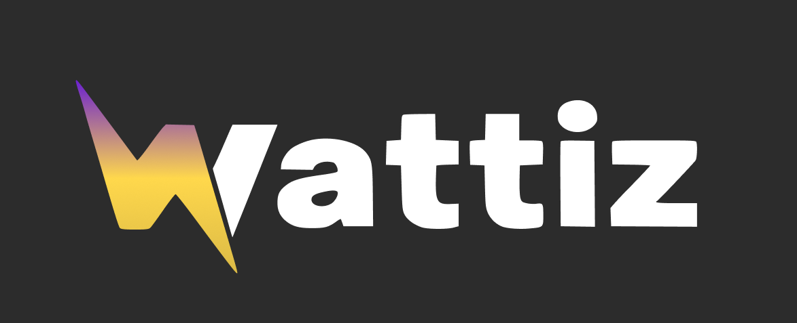

# :zap: Wattiz - Energia Inteligente para Todos

Plataforma desenvolvida para auxiliar usuários residenciais a **monitorar, entender e reduzir o consumo de energia elétrica** de forma simples, acessível e inteligente.  
O projeto tem como objetivo transformar qualquer residência em um ambiente mais eficiente energeticamente, sem necessidade de alterações na infraestrutura.

---

## :rocket: Funcionalidades Principais
- Monitoramento de consumo de energia em tempo real
- Leitura híbrida: tomada + medidor digital (sensor óptico)
- Estimativa da conta de luz com base na região e horários de uso
- Análise inteligente com IA (Lume)
- Alertas de consumo elevado
- Sugestões de economia personalizadas
- Interface simples e acessível

---

## :bar_chart: Estrutura do Sistema
- **Usuário**: acompanha consumo e recebe insights  
- **Hardware**: coleta dados pela tomada e pelo relógio  
- **Lume (IA)**: analisa dados, corrige inconsistências e gera previsões  

---

## 🛠️ Tecnologias Utilizadas
- Hardware com sensores de corrente e sensor óptico  
- Comunicação via Wi-Fi  
- Interface web/mobile  
- Backend para processamento de dados  
- IA Lume para análise e previsão  

---

## :globe_with_meridians: Funcionamento
1. Dispositivo conectado na tomada  
2. Sensor realiza leitura do medidor  
3. Dados enviados para o sistema  
4. Lume processa as informações  
5. Usuário visualiza no app  

---

## :pushpin: Observações Finais
O Wattiz busca promover:
- Consciência no consumo de energia  
- Redução de gastos  
- Acesso à tecnologia  
- Sustentabilidade  

---

## :bulb: Diferencial
- Não exige troca do medidor  
- Instalação simples (plug and play)  
- Funciona em qualquer residência  
- Dupla leitura (tomada + relógio)  
- IA que interpreta e prevê custos  
